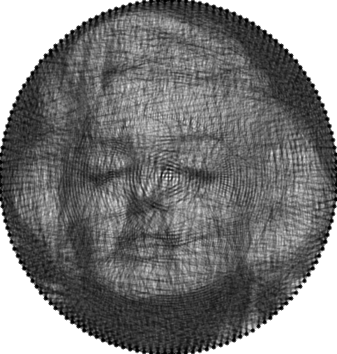

# String-Art

###Introduction
String-art is created by threading a single piece of string across a circle whose perimeter is surrounded by nails. This project started out with the curiosity of studying the positions of the starting nails, but quickly became a more extensive project that implements weighted images, and in the future, multiple colors.

###How to Run
There's a UI that handles interaction with it so anyone can use it if their heart desires. In the UI, there's an option to load an image, add a weighted image if the user wants to, but it is not required, and run or stop the program. The outputted image is saved to an image called "Spinboard.png", which will get overwritten if it exists. You can also control the number of nails on the perimeter, and the number of threads added.
When the run is started, if there are no nails selected by the user, an ellipse best fitting the shape of the image will automatically become the perimeter.

##Progression:
\<Images, research/credit, and detailed progression highlighting results to come\>
